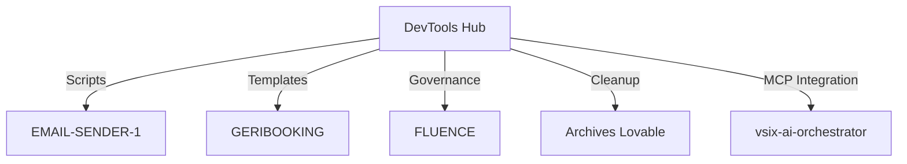
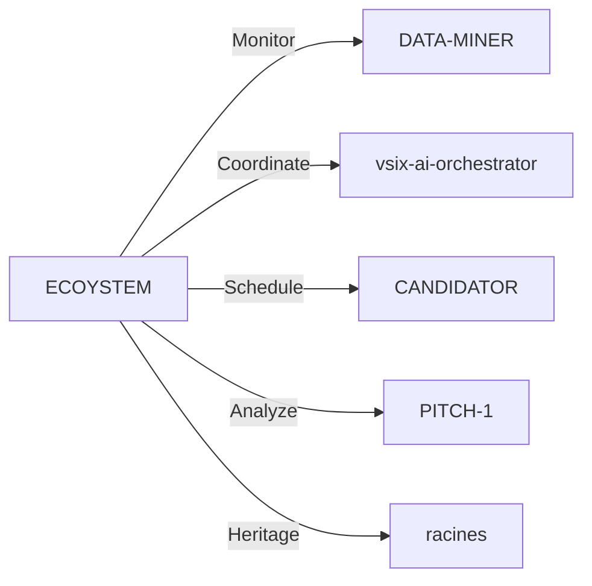

# Playbook: Orchestration Écosystème Multi-Dépôts

## 🌐 VISION TRANSVERSALE

Orchestration intelligente de l'écosystème ECOSYSTEM-1 via DATA-MINER,
avec DevTools comme hub central et ECOYSTEM comme orchestrateur principal.

## 🔄 FLOWS D'INTERACTIONS

### **DevTools Hub → Satellites**

### **ECOYSTEM Orchestrator → All**  

## 🎛️ POINTS DE CONTRÔLE

1. **Santé Écosystème** : Monitoring cross-repo health scores
2. **Quality Gates** : Prévention dégradation via CI rules
3. **Dependency Management** : Éviter conflits et cycles
4. **Resource Optimization** : Partage assets communs
5. **Memory Coordination** : Patterns EMAIL-SENDER-1 appliqués

## 📊 MÉTRIQUES ORCHESTRATION

- **Coupling Score** : Mesure interdépendances (cible < 0.5)
- **Health Index** : Indicateur santé globale (cible > 8.0/10)  
- **Innovation Velocity** : Rapidité implémentation nouvelles features
- **Technical Debt** : Dette technique accumulée (cible < 15%)
- **Memory Efficiency** : Patterns gestion mémoire appliqués

## 🔧 OUTILS D'ORCHESTRATION

### **DevTools → Centralisateur**
- Scripts PowerShell transversaux
- Templates durcis Lovable
- Governance policies
- Branch management référence

### **ECOYSTEM → Coordinateur**  
- Monitoring santé dépôts
- Synchronisation cross-repo
- Planification releases
- Métriques agrégées

### **DATA-MINER → Analyseur**
- Mining patterns empiriques
- Anti-patterns detection
- Playbooks génération
- Dashboard MSR temps réel

## 🚨 ALERTES & ESCALATIONS

- **Critical** : Anti-pattern BLOCKING détecté
- **High** : Coupling score > seuil
- **Medium** : Tech debt > 20%
- **Low** : Documentation obsolète

## 📈 AMÉLIORATION CONTINUE

Chaque cycle d'orchestration met à jour :
- Patterns catalog enrichi
- Playbooks affinés  
- Templates optimisés
- Métriques calibrées

---
*Basé sur architecture EMAIL-SENDER-1 et expérience 30 suppressions Lovable*